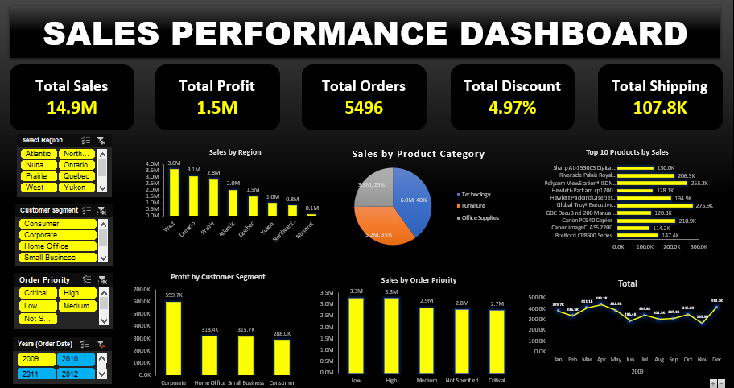

# 📊 Retail Sales & Profit Analysis Dashboard


---

# 📌 Project Overview

This project presents an interactive **Retail Sales & Profit Analysis Dashboard** developed in **Microsoft Excel**.

The project analyzes retail transaction data to evaluate **sales performance, profitability, customer segments, product categories, regions, order priorities, and monthly sales trends**. The dashboard converts raw business data into clear KPIs and actionable insights for decision-making.

---

# 🎯 Business Problem

Retail businesses need to understand which regions, products, customer segments, and time periods are contributing most to revenue and profit.

This project aims to answer key business questions such as:

- Which region generates the highest sales?
- Which product category performs best?
- Which customer segment generates the most profit?
- Which products contribute the most revenue?
- How do sales change month by month?
- Which order priorities generate the highest sales?

---

# 📁 Dataset Information

| Attribute | Details |
|---|---|
| Industry | Retail |
| File Format | Excel (.xlsx) |
| Analysis Tool | Microsoft Excel |
| Analysis Type | Sales & Profit Analysis |

---

# 🛠 Tools & Techniques

- Microsoft Excel
- Data Cleaning
- Pivot Tables
- Pivot Charts
- KPI Cards
- Conditional Formatting
- Business Analysis
- Data Visualization
- Interactive Dashboard Design

---

# 📊 Dashboard KPIs

The analysis tracks important business metrics:

- 💰 **Total Sales:** $14.92M
- 📈 **Total Profit:** $1.52M
- 🛒 **Total Orders:** 5,496
- 🏷️ **Average Discount:** 4.97%
- 🚚 **Total Shipping Cost:** $107.83K

---

# 📈 Business Analysis

The dashboard analyzes:

- Sales by Region
- Sales by Product Category
- Top 10 Products by Sales
- Profit by Customer Segment
- Sales by Order Priority
- Monthly Sales Trend
- Overall Sales & Profit Performance

---

# 💡 Key Insights

- 🌎 **West** is the top-performing region by sales.
- 💻 **Technology** is the leading product category by sales.
- 👥 **Corporate** customers generate the highest profit.
- 📅 **April** records the highest monthly sales.
- 📦 **Low-priority orders** generate the highest sales among order priorities.
- 💰 The business generates strong overall sales and positive profitability.

---

# 💼 Business Recommendations

Based on the analysis:

- Focus on high-performing regions and product categories.
- Strengthen relationships with profitable customer segments.
- Monitor monthly sales trends to identify seasonal opportunities.
- Optimize inventory around high-performing products.
- Review discount and shipping costs to improve overall profitability.

---

# 📷 Dashboard Preview

> Add your dashboard screenshot below.



---

# 🚀 Skills Demonstrated

- Advanced Excel
- Data Cleaning
- Sales Analysis
- Profit Analysis
- KPI Development
- Pivot Table Analysis
- Dashboard Development
- Data Visualization
- Business Intelligence
- Business Reporting

---

# 📂 Repository Structure

```text
Retail-Sales-Profit-Analysis
│
├── Project Retail Sales & Profit Analysis.xlsx
├── Dashboard.png
└── README.md
```

---

# 🔮 Future Enhancements

- Add Power Query automation
- Build a Power BI version
- Connect the analysis to a SQL database
- Add sales and profit forecasting
- Develop advanced customer segmentation
- Automate dashboard refresh

---

# 👨‍💻 Author

**Manish Kashyap**

💻 GitHub: [Manish-kashyap](https://github.com/Manish-kashyap)

---

⭐ If you found this project useful, feel free to star the repository.
